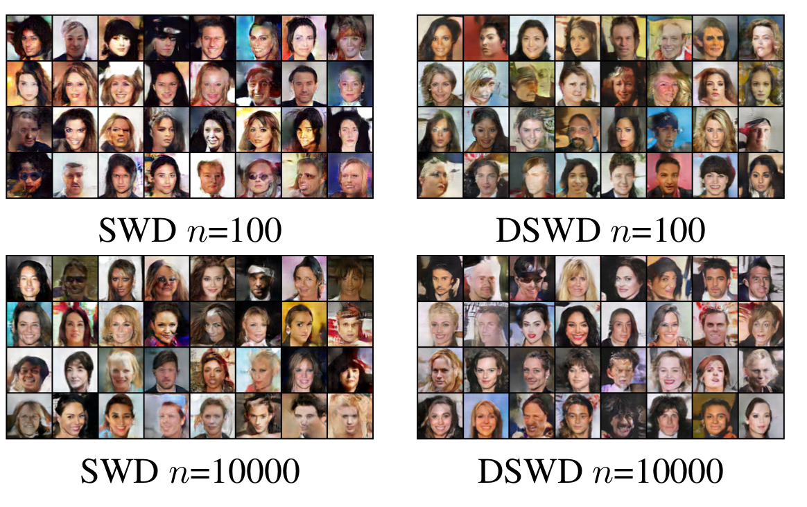

## Distributional Sliced Wasserstein distance
### Requirement

* python3.6
* pytorch 1.3
* torchvision
* numpy
* tqdm
### Train on MNIST and FMNIST
``` 
python mnist.py \
    --datadir='./' \
    --outdir='./result' \
    --batch-size=512 \
    --seed=16 \
    --p=2 \
    --lr=0.0005 \
    --dataset='MNIST'
    --model-type='DSWD'\
    --latent-size=32 \ 
```
```
model-type in (SWD|MSWD|DSWD|GSWD|DGSWD|JSWD|JMSWD|JDSWD|JGSWD|JDGSWD|CRAMER|JCRAMER|SINKHORN|JSINKHORN)
```
Options for Sliced distances (number of projections used to approximate the distances)
````
--num-projection=1000
````

Options for Max Sliced-Wasserstein distance and Distributional distances (number of gradient steps for find the max slice or the optimal push-forward function):

```
--niter=10
```
Options for Distributional Sliced-Wasserstein Distance and Distributional Generalized Sliced-Wasserstein Distance (regularization strength)

````
--lam=10
````
Options for Generalized Wasserstein Distance (using circular function for Generalized Radon Transform)

````
--r=1000;\
--g='circular'
````
### Train on CELEBA and CIFAR10
``` 
python main.py \
    --datadir='./' \
    --outdir='./result' \
    --batch-size=128 \
    --seed=16 \
    --p=2 \
    --lr=0.0005 \
    --model-type='DSWD'\
    --dataset='CELEBA'
    --latent-size=100 \ 
```
```
model-type in (SWD|MSWD|DSWD|GSWD|DGSWD|CRAMER)
```
Options for Sliced distances (number of projections used to approximate the distances)
````
--num-projection=1000
````
Options for Max Sliced-Wasserstein distance and Distributional distances (number of gradient steps for find the max slice or the optimal push-forward function):

```
--niter=1
```
Options for Distributional Sliced-Wasserstein Distance and Distributional Generalized Sliced-Wasserstein Distance (regularization strength)

````
--lam=1
````
Options for Generalized Wasserstein Distance (using circular function for Generalized Radon Transform)

````
--r=1000;\
--g='circular'
````

## Some generated images
##### MNIST generated images
 
##### CELEBA generated images
 